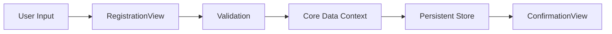

# 📅 EventHub - Event Registration iOS App

<div align="center">


**A modern, elegant iOS event registration application built with SwiftUI and Core Data**

[Features](#-features) • [Installation](#-installation) • [Usage](#-usage) • [Architecture](#-architecture) • [Screenshots](#-screenshots)

</div>

---

## 📖 Overview

EventHub is a beautifully designed iOS application that allows users to register for events seamlessly. Built with SwiftUI and Core Data, it provides a smooth, native iOS experience with persistent data storage.

## ✨ Features

<table>
<tr>
<td width="50%">

### 🎯 Core Features
- ✅ User-friendly registration form
- ✅ Real-time form validation
- ✅ Persistent data storage with Core Data
- ✅ Elegant confirmation screen
- ✅ Registrant list management
- ✅ Delete functionality with swipe gestures

</td>
<td width="50%">

### 🎨 Design Features
- ✨ Modern, clean UI design
- ✨ Smooth animations
- ✨ SF Symbols icons throughout
- ✨ Blue accent color theme
- ✨ Responsive layout
- ✨ iOS native components

</td>
</tr>
</table>

## 🛠 Technical Stack

<div align="center">

| Technology | Description |
|------------|-------------|
| **SwiftUI** | Modern declarative UI framework |
| **Core Data** | Persistent data storage |
| **Swift 5.9+** | Programming language |
| **iOS 17.0+** | Minimum deployment target |
| **Xcode 15+** | Development environment |

</div>

## 📱 Screenshots

<div align="center">

### Registration Screen
*Clean and intuitive form with validation*

```
┌──────────────────────┐
│  📅 Event Registration│
│                       │
│  👤 Full Name         │
│  ✉️  Email            │
│  📆 Age: 18           │
│  👥 Gender            │
│  🎓 Student Toggle    │
│                       │
│  [✓ Submit]           │
└──────────────────────┘
```

### Confirmation Screen
*Beautiful success feedback*

```
┌──────────────────────┐
│                       │
│       ✅              │
│   Thank you for       │
│   registering!        │
│                       │
│  ┌─────────────────┐ │
│  │ 👤 Name: John   │ │
│  │ ✉️  Email: ...  │ │
│  │ 📆 Age: 25      │ │
│  │ 👥 Gender: Male │ │
│  │ 🎓 Student: Yes │ │
│  └─────────────────┘ │
│                       │
│  [+ Register Another] │
└──────────────────────┘
```

</div>

## 🚀 Installation

### Prerequisites

- macOS 14.0 or later
- Xcode 15.0 or later
- iOS 17.0+ device or simulator

### Steps

1. **Clone the repository**
   ```bash
   git clone https://github.com/yourusername/eventhub.git
   cd eventhub
   ```

2. **Open in Xcode**
   ```bash
   open Eventhub.xcodeproj
   ```

3. **Create Core Data Model**
   - File → New → File → Data Model
   - Name it `Eventhub.xcdatamodeld`
   - Add `Registrant` entity with attributes:
     - `id` (UUID)
     - `fullname` (String)
     - `email` (String)
     - `age` (Integer 16)
     - `gender` (String)
     - `isStudent` (Boolean)
     - `timestamp` (Date)

4. **Build and Run**
   - Select your target device/simulator
   - Press `Cmd + R` or click the Play button

## 💻 Usage

### Registering a New Attendee

1. Launch the app
2. Fill in all required fields:
   - **Full Name**: Enter the attendee's name
   - **Email**: Provide a valid email address
   - **Age**: Use stepper to set age (18-100)
   - **Gender**: Select from dropdown
   - **Student Status**: Toggle on/off
3. Tap "Submit Registration"
4. View confirmation screen with all details
5. Tap "Register Another" to add more attendees

### Viewing All Registrants

1. Navigate to the Registrant List View
2. See all registered attendees
3. Swipe left on any entry to delete
4. Use Edit button for batch operations

## 🏗 Architecture

### Project Structure

```
Eventhub/
├── ContentView.swift           # Main app file with all views
├── Eventhub.xcdatamodeld       # Core Data model
├── Assets.xcassets             # Images and colors
└── Info.plist                  # App configuration
```

### Components

<details>
<summary><b>📱 Views</b></summary>

- **RegistrationView**: Main registration form
- **ConfirmationView**: Success screen with details
- **RegistrantListView**: List of all registrants
- **DetailRow**: Reusable component for displaying info

</details>

<details>
<summary><b>💾 Data Layer</b></summary>

- **PersistenceController**: Core Data stack manager
- **Registrant Entity**: Core Data model for registrants
- **Extension Methods**: Helper methods for CRUD operations

</details>

### Data Flow



## 🔧 Configuration

### Core Data Setup

The app uses Core Data for persistent storage. The model is configured as follows:

```swift
Entity: Registrant
- id: UUID (Primary Key)
- fullname: String
- email: String
- age: Int16
- gender: String
- isStudent: Bool
- timestamp: Date
```

### Validation Rules

- **Full Name**: Cannot be empty
- **Email**: Must contain @ and .
- **Age**: Minimum 18 years old
- **Gender**: Must select from predefined options
- **Student**: Boolean toggle

## 🎨 Customization

### Changing the Theme Color

Replace all instances of `.blue` in the code with your preferred color:

```swift
// Change from
.foregroundColor(.blue)

// To
.foregroundColor(.purple) // or any Color
```

### Modifying Form Fields

Add new fields by editing the `RegistrationView` and `Registrant` entity:

1. Add property to Core Data model
2. Add `@State` variable in `RegistrationView`
3. Add form field in the body
4. Update validation and save logic

## 🐛 Troubleshooting

<details>
<summary><b>Core Data Errors</b></summary>

**Problem**: App crashes with "Entity not found" error

**Solution**:
1. Ensure `Eventhub.xcdatamodeld` file exists
2. Check entity name is exactly "Registrant"
3. Verify Codegen is set to "Class Definition"
4. Clean build folder (Shift + Cmd + K)

</details>

<details>
<summary><b>Duplicate Symbol Errors</b></summary>

**Problem**: Multiple commands produce same output

**Solution**:
1. Delete manually created `Registrant+CoreDataClass.swift` files
2. Let Xcode auto-generate Core Data classes
3. Clean and rebuild project

</details>

## 📝 Future Enhancements

- [ ] QR code generation for registrants
- [ ] Export registrant list to CSV
- [ ] Email confirmation sending
- [ ] Event selection dropdown
- [ ] Photo upload for attendees
- [ ] Search and filter functionality
- [ ] Dark mode optimization
- [ ] Localization support

## 🤝 Contributing

Contributions are welcome! Please follow these steps:

1. Fork the repository
2. Create a feature branch (`git checkout -b feature/AmazingFeature`)
3. Commit your changes (`git commit -m 'Add some AmazingFeature'`)
4. Push to the branch (`git push origin feature/AmazingFeature`)
5. Open a Pull Request

## 📄 License

This project is licensed under the MIT License - see the [LICENSE](LICENSE) file for details.

## 👨‍💻 Author

**Dhruv Rasikbhai Jivani**

- GitHub: [@yourusername](https://github.com/yourusername)
- Email: your.email@example.com

## 🙏 Acknowledgments

- SwiftUI documentation and community
- SF Symbols for beautiful icons
- Apple's Core Data framework
- iOS development community

---

<div align="center">

**⭐ Star this repo if you find it helpful!**

Made with ❤️ and Swift

</div>
